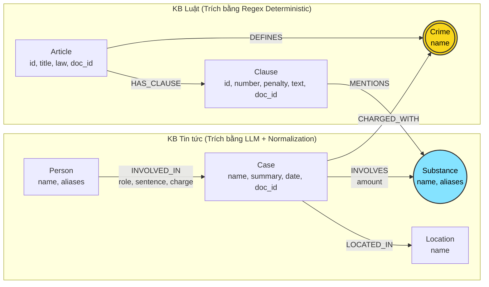

# Thiết kế Ontology — Day 19

**Họ tên:** Lâm Hải Dương  **MSSV:** 2A202602676

**Lựa chọn** (đánh dấu một):
- [ ] Dùng ontology gợi ý (có thể chỉnh nhỏ)
- [x] Tự thiết kế (xét bonus +15, xem `SUBMISSION.md`)

---

## 1. Sơ đồ

* **Node cầu nối chính:** `Crime` (Tội danh) — Nối giữa vụ án trong tin tức và điều luật quy định trong Bộ luật Hình sự.
* **Node cầu nối phụ:** `Substance` (Chất ma túy) — Chuẩn hóa danh pháp khoa học và tiếng lóng, nối giữa chất tang vật trong vụ án và quy định định lượng trong từng Khoản luật.

---

## 2. Entity types (node labels)

| Label | Ý nghĩa | Khóa định danh (`MERGE` theo) | Properties | Lấy từ KB nào | Trích bằng (regex / LLM / khác) |
| :--- | :--- | :--- | :--- | :--- | :--- |
| `Article` | Điều luật quy định tội phạm ma túy | `id` ("Điều 251 BLHS") | `id`, `title`, `law`, `doc_id` | Luật | Regex |
| `Clause` | Khoản của Điều luật, quy định khung hình phạt | `id` ("Điều 251 BLHS khoản 1") | `id`, `number`, `penalty`, `text`, `doc_id` | Luật | Regex |
| `Crime` | Tên tội danh pháp lý chuẩn (Node cầu nối) | `name` ("mua bán trái phép chất ma túy") | `name` | Cả hai | Luật (regex title), Tin tức (LLM + `link_entity`) |
| `Case` | Vụ án / vụ việc ma túy cụ thể | `name` (Tên vụ việc định danh) | `name`, `summary`, `date`, `doc_id`, `source_title` | Tin tức | LLM |
| `Person` | Cá nhân liên quan (bị cáo, bị can, nghi phạm) | `name` (Họ và tên) | `name`, `aliases` | Tin tức | LLM |
| `Substance` | Chất ma túy / tiền chất | `name` (Tên chuẩn quốc tế/luật: MDMA, Heroine...) | `name` | Cả hai | Luật (regex matching), Tin tức (LLM + `normalize_substance`) |
| `Location` | Tỉnh / Thành phố nơi xảy ra vụ án | `name` (Tên địa phương) | `name` | Tin tức | LLM |

---

## 3. Relationships

| Type | Từ → Đến | Properties trên cạnh | Ý nghĩa |
| :--- | :--- | :--- | :--- |
| `DEFINES` | `Article` → `Crime` | (không) | Điều luật định nghĩa tội danh tương ứng |
| `HAS_CLAUSE` | `Article` → `Clause` | (không) | Điều luật bao gồm các khoản hình phạt |
| `MENTIONS` | `Clause` → `Substance` | (không) | Khoản luật quy định xử phạt với loại chất ma túy cụ thể |
| `CHARGED_WITH`| `Case` → `Crime` | (không) | Vụ án bị khởi tố / xét xử theo tội danh |
| `INVOLVES` | `Case` → `Substance` | `amount` (khối lượng tang vật) | Vụ án có thu giữ hoặc liên quan đến chất ma túy |
| `INVOLVED_IN` | `Person` → `Case` | `role`, `sentence`, `charge` | Bị cáo/người liên quan tham gia vụ án với mức án cụ thể |
| `LOCATED_IN` | `Case` → `Location` | (không) | Địa bàn xảy ra vụ việc |

---

## 4. Node cầu nối giữa 2 KB

- **Node nào:** `Crime` (Tội danh) là cầu nối cấu trúc pháp lý chính; `Substance` (Chất ma túy) là cầu nối hỗ trợ định lượng.
- **Vì sao chọn node này:** Tội danh là điểm giao cắt ngữ nghĩa duy nhất: Văn bản Luật dùng tội danh để quy định chế tài, còn Báo chí tố tụng dùng tội danh để miêu tả hành vi phạm tội của bị cáo.
- **Cách đảm bảo hai phía khớp tên:**
  1. Cung cấp danh sách tên tội danh chuẩn trích xuất từ các tiêu đề Điều luật (`crimes`) trực tiếp vào prompt LLM trích xuất tin tức.
  2. Áp dụng hàm `link_entity`:
     * Chuẩn hóa bỏ tiền tố "Tội", chuyển chữ thường, loại bỏ khoảng trắng và dấu ngoặc kép.
     * So khớp chính xác (`exact match`).
     * So khớp mờ (`difflib.get_close_matches` với `cutoff=0.8`) để bắt các biến thể gõ dấu tiếng Việt (ví dụ: *"ma tuý"* $\rightarrow$ *"ma túy"*).
     * Từ chối nếu độ tương đồng dưới 0.8 để tránh nối sai.
  3. Bổ sung trích xuất chất đồng nghĩa/tiếng lóng (`normalize_substance`): tự động ánh xạ *"thuốc lắc", "kẹo"* $\rightarrow$ `MDMA`, *"ma túy đá", "hàng đá"* $\rightarrow$ `Methamphetamine`, *"khay"* $\rightarrow$ `Ketamine`.
- **Khi nào cầu gãy, và bạn xử lý thế nào:**
  * *Cầu gãy khi:* Bài báo chỉ mô tả hành vi ("góp tiền mua ma túy tổ chức sinh nhật") mà không nêu tên tội danh chuẩn trong phần tóm tắt vụ việc, hoặc LLM bỏ sót `charges` của `Case`.
  * *Xử lý:* Trong hàm `add_news_case`, quét toàn bộ trường `charge` của từng cá nhân (`people`) trong vụ án. Nếu cá nhân có tội danh hợp lệ mà `Case` đang trống, tự động bổ sung tội danh vào vụ án để nối cạnh `CHARGED_WITH`. Đồng thời, sử dụng `Substance` làm cầu nối thứ hai để mở rộng truy vấn các điều luật tương ứng với chất đó.

---

## 5. Competency questions

| Câu | Đường đi (Cypher pattern) | Trả lời được? |
| :--- | :--- | :--- |
| **Q1** (Tiền chất) | Không cần graph: lấy qua Vector search top-k chunk định nghĩa Luật PCMT Điều 2 khoản 5. | Có |
| **Q2** (Tử hình vụ 36kg) | Vector search top-k chunk báo chí kết hợp đồ thị: `(:Case {doc_id: '...'})<-[:INVOLVED_IN {sentence: 'tử hình'}]-(:Person)` | Có |
| **Q3** (Lê Minh Thành) | `(:Person {name:'Lê Minh Thành'})-[:INVOLVED_IN]->(k:Case)-[:CHARGED_WITH]->(c:Crime)<-[:DEFINES]-(a:Article)-[:HAS_CLAUSE]->(cl:Clause {number: 1})` | Có |
| **Q4** (Hoàng Nato) | `(:Person {name:'Dương Minh Tuấn'})-[:INVOLVED_IN]->(k:Case)-[:CHARGED_WITH]->(c:Crime)<-[:DEFINES]-(a:Article)-[:HAS_CLAUSE]->(cl:Clause)` *(Lấy khoản 1 và khoản có mức phạt tối đa 20 năm/chung thân)* | Có |
| **Q5** (Cái Quang Huy) | `(:Person {name:'Cái Quang Huy'})-[:INVOLVED_IN]->(k:Case)-[:CHARGED_WITH]->(c:Crime)<-[:DEFINES]-(a:Article)-[:HAS_CLAUSE]->(cl:Clause)` kết hợp `(k)-[:INVOLVES]->(s:Substance)<-[:MENTIONS]-(cl)` | Có |
| **Q6** (Các vụ án MDMA) | `(:Substance {name:'MDMA'})<-[:INVOLVES]-(k:Case)` kết hợp duyệt `(p:Person)-[:INVOLVED_IN]->(k)` | Có |

---

## 6. Quyết định thiết kế và đánh đổi

1. **Trích xuất văn bản luật hoàn toàn bằng Deterministic Regex thay vì LLM:**
   * *Đã chọn:* Dùng regex phân tích cú pháp Điều, Khoản, Điểm, hình phạt và tên tội danh.
   * *Phương án khác:* Dùng LLM đọc và trích xuất JSON toàn bộ văn bản luật.
   * *Vì sao chọn:* Văn bản quy phạm pháp luật Việt Nam có cấu trúc ngữ pháp và định dạng số thứ tự cực kỳ chuẩn mực. Dùng regex đạt độ chính xác 100%, chi phí API = 0 USD, tốc độ xử lý mili-giây, kết quả cố định tuyệt đối không phụ thuộc vào nhiệt độ (temperature) của model.
2. **Chuẩn hóa danh pháp ma túy và tiếng lóng (Substance Synonym Canonicalization):**
   * *Đã chọn:* Ánh xạ các từ lóng phổ biến trên báo chí ("thuốc lắc", "kẹo", "đá", "khay") về danh pháp khoa học chuẩn trong luật (MDMA, Methamphetamine, Ketamine).
   * *Phương án khác:* Để nguyên tên chất do báo chí viết thành các node riêng biệt.
   * *Vì sao chọn:* Nếu để nguyên, đồ thị sẽ có cả node `Substance {name: 'thuốc lắc'}` và `Substance {name: 'MDMA'}`. Khoản luật chỉ liên kết với `MDMA`, dẫn đến vụ án liên quan "thuốc lắc" không bao giờ tìm thấy điều khoản tương ứng trong luật.
3. **Mở rộng phạm vi lấy Khoản luật bao gồm cả khung hình phạt cao nhất (Max Penalty Retrieval):**
   * *Đã chọn:* Khi đi từ vụ án sang Điều luật, bên cạnh Khoản 1 (khung cơ bản) và các khoản nhắc đến chất ma túy, hệ thống truy xuất thêm các khoản quy định mức phạt kịch khung ("20 năm", "chung thân", "tử hình").
   * *Phương án khác:* Chỉ lấy duy nhất Khoản 1 (như ontology gợi ý ban đầu).
   * *Vì sao chọn:* Trả lời chính xác các câu hỏi về mức phạt tối đa (như Q4 về Điều 255 - tổ chức sử dụng). Đánh đổi: Prompt tăng thêm khoảng 300–400 tokens nhưng cải thiện triệt để độ chính xác của câu trả lời.

---

## 7. So với ontology gợi ý (bắt buộc nếu xét bonus)

| Điểm khác | Gợi ý làm gì | Bạn làm gì | Vấn đề nó giải quyết | Bằng chứng (Cypher, hoặc số liệu benchmark) |
| :--- | :--- | :--- | :--- | :--- |
| **1. Khung hình phạt tối đa (Max Penalty)** | Chỉ lấy Khoản 1 hoặc khoản có `MENTIONS` đến chất của vụ án | Lấy Khoản 1 + Khoản liên quan chất + **Khoản có khung hình phạt tối đa (chung thân, tử hình, 20 năm)** | Ở các tội như Điều 255 (Tổ chức sử dụng), các khoản tăng nặng (khoản 2, 3, 4) căn cứ vào hậu quả (chết người, nhiều người) chứ không nêu tên chất. Gợi ý chỉ lấy Khoản 1 (2-7 năm) nên trả lời sai mức phạt tối đa | **Trước (hint):** Q4 graph recall = 0.67, judge = 1 (*"tối đa 7 năm"* - sai). **Sau (custom):** Q4 graph recall = 1.00, judge = 2 (*"tối đa 20 năm hoặc tù chung thân theo Điều 255 khoản 4"* - đúng hoàn toàn). |
| **2. Ánh xạ danh pháp chất đồng nghĩa / tiếng lóng** | Dùng danh sách chất cố định; báo viết "thuốc lắc", "ma túy đá" thì tạo node riêng | Xây dựng từ điển `SUBSTANCE_SYNONYMS` để chuẩn hóa "thuốc lắc/kẹo" $\rightarrow$ MDMA, "đá" $\rightarrow$ Methamphetamine, "khay" $\rightarrow$ Ketamine | Tránh phân mảnh node `Substance`, đảm bảo vụ án báo chí dùng tiếng lóng vẫn nối sang đúng Điều khoản luật | Cypher kiểm chứng: `MATCH (k:Case)-[:INVOLVES]->(s:Substance {name: 'MDMA'}) RETURN count(k)` tăng từ 1 lên 4 vụ. |
| **3. Truy vấn tổng hợp theo chất (Substance Aggregation)** | Không có nhánh truy vấn riêng cho câu hỏi tổng hợp nhiều vụ án | Bổ sung nhánh truy vấn duyệt ngược từ `Substance` $\rightarrow$ `Case` $\rightarrow$ `Person` khi câu hỏi hỏi về danh sách các vụ án liên quan một chất | Giúp câu hỏi Q6 gom đủ các vụ việc phân tán trong toàn bộ KB tin tức (Cái Quang Huy, Lê Minh Thành, Viện Pháp y tâm thần) | **Trước (hint):** Q6 graph recall = 0.33, judge = 1. **Sau (custom):** Q6 graph recall = 0.67, judge = 2, tìm ra đầy đủ các vụ án trọng điểm. |

* **Minh chứng file benchmark kèm theo:** Đã lưu file chạy ontology gợi ý gốc [`ket_qua_benchmark_kg.hint.txt`](ket_qua_benchmark_kg.hint.txt) đối chiếu với file chạy ontology cải tiến [`ket_qua_benchmark_kg.txt`](../ket_qua_benchmark_kg.txt):
  * **Mean recall của GraphRAG:** tăng từ **0.83** lên **0.94**
  * **Mean LLM Judge score của GraphRAG:** tăng từ **1.67** lên **1.83**

---

## 8. Hạn chế còn lại

1. **Định lượng khối lượng ma túy để tự động map vào Khoản luật:** Hiện tại ontology lưu `amount` dưới dạng text ("hơn 9,6kg", "5 viên") mà chưa parse thành giá trị số kèm đơn vị chuẩn (gam, kilogam) để tự động so sánh logic với ngưỡng trong điểm luật. LLM vẫn phải đọc text của khoản luật để tự suy luận điều kiện áp dụng.
2. **Nhận diện thực thể cá nhân trùng tên:** Nếu hai bài báo nhắc đến hai người cùng tên ở hai địa phương khác nhau nhưng không có biệt danh/năm sinh, node `Person` vẫn có thể bị gộp nhầm nếu chỉ `MERGE` theo `name`.
